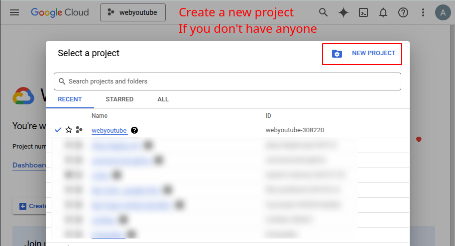
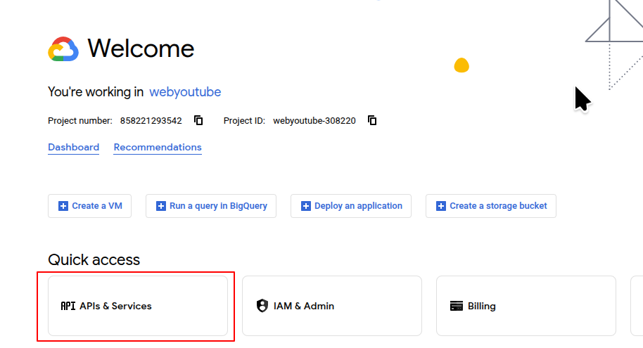
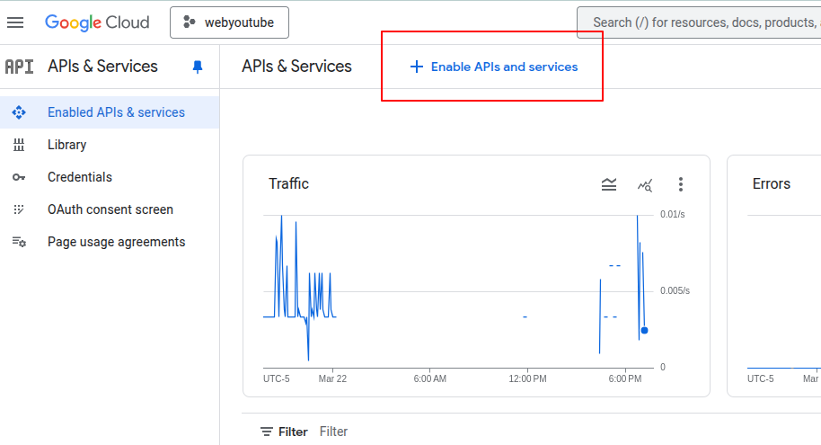
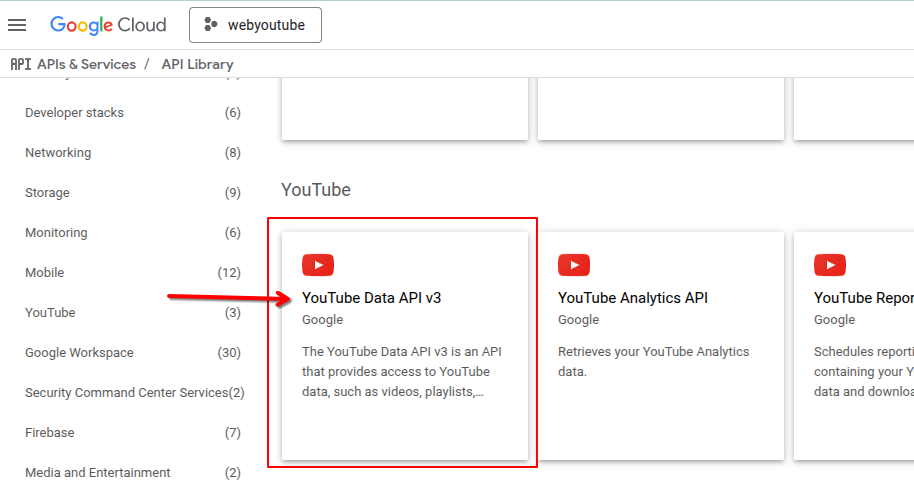
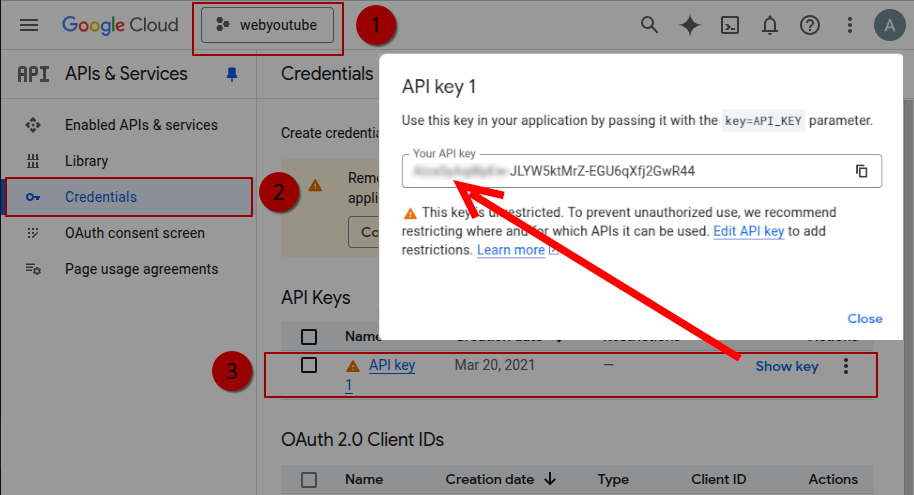
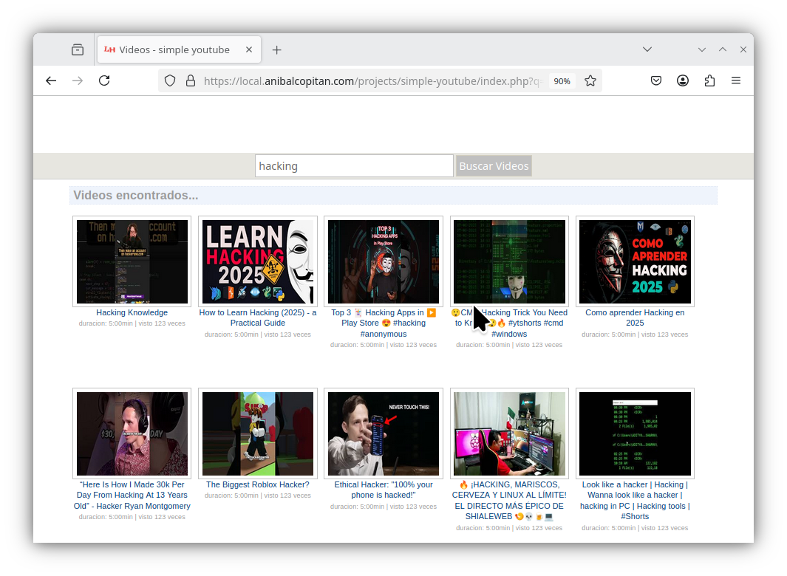

# simple-youtube v4

This project use API Youtube v3. For seachr and list videos using `php`

## Config repo : simple youtube

`/recursos/config/config.ini`

```
  [pagina]
  host = //localhost/acopitan/yo/htdocs/simle_youtube/
  titulo = simple youtube
  ancho = 900
  your_api_key = XXXXXXXXXX
```

1. `host`: Establecer tu dominio si es en produccion: `//example.com/` o si funciona en tu local `//localhost/`  
2. `your_api_key`: Poner aqui la API_KEY.
Crear una cuenta en [Google Cloud Platform](https://console.cloud.google.com/) crear un proyecto nuevo y en la sección **API Library** **Youtube Data API V3**, crear tu propia llave.
También puedes documentarte sobre la [Api Youtube v3 aquí](https://developers.google.com/youtube/v3/getting-started)

## Paso a Paso crear tu llave en GoogleCloudPlatform

Esta es un paso a paso rapido y breve si necesitas mas apoyo revisa la documentación propia de Google Cloud Platform:












## Preview Web

